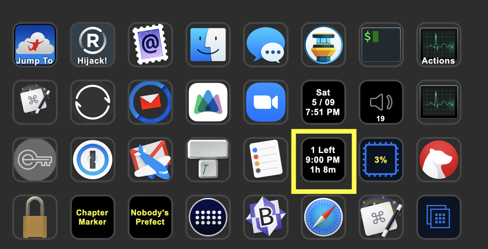
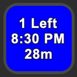
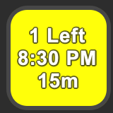
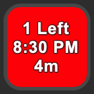

# What and Why?

I have a [Elgato Stream Deck XL - Advanced Stream Control with 32 customizable LCD keys](https://smile.amazon.com/Elgato-Stream-Deck-XL-customizable/dp/B07RL8H55Z) on my desk attached to my Mac, and it’s one of my favorite accessories I’ve found in years.

Most of the time I’m just doing simple-but-handy things like launching an application, but my favorite ones are the buttons which can control [Keyboard Maestro macros](http://www.keyboardmaestro.com/). I have one that immediately locks my computer (handy for if I need to walk away and don’t want to leave it open for any riff-raff to noddle around with. I have another which toggles [my Encrypt.me VPN](https://encrypt.me/) and shows me, at glance, if my VPN is active or not.

I even made an entire profile devoted to [Relay.fm podcasts](https://talk.macpowerusers.com/t/stream-deck-xl-and-relay-fm/13338).

***But the one that I am posting here is the one I am both _most proud of_ and think is _the most useful_.***

See that yellow box?

That yellow box is around `R3C6` which is not C3PO’s cousin, it’s **[R]ow [3], [C]olumn [6]** on my Stream Deck.

`R3C6` keeps me from missing meetings. And I’m not just saying that. Recently, when I had `R3C6` disabled for uninteresting reasons, ***I completely missed a meeting.***

Right now, `R3C6` is telling me that I have 1 meeting left today, that meeting is scheduled to start at 9:00 p.m., and I have about 1 hour & 8 minutes before that meeting starts.

Here’s the best part: after I did the initial configuration and setup ***everything else is automated.*** The meeting information comes directly from my calendar. If that meeting gets moved to 8:00 p.m. or 9:30 p.m. in my calendar, this button will show the updated information in one minute.

 I can hear you thinking **_”Wait, what just happened?!”_** Well, I’ll tell you what happened. The meeting was rescheduled to 8:30 p.m. instead of 9:00 p.m. and now the button has changed to a blue color. That’s my 30-minute warning, and happens before every meeting. Since the Stream Deck is always in my peripheral vision, the color change is likely to catch my eye. The blue is a nice way to say “Hey, just a reminder, your next meeting is coming up.”

Again, all of that happens automatically.

 **When it gets to 15 minutes or less, the button turns yellow.**

Yellow means “HEY! It’s time to get ready now!”

If we’re meeting on Zoom (and, let’s face it, we probably are) I need to make sure that I’m set up for that.

By which I mean that I probably need to comb my hair and put on a nicer shirt.

 **10 minutes and counting!**

Orange is the Patron Saint of “No, Really, Stop what you are doing and _get ready!_”

It’s a step up from yellow, but not quite red.

This is the voice your Mom used when she had to ask you to do something that she asked you to do before, but you forgot. You did not want her to have to use that voice, but sometimes she had to.

 **5 minutes or less, now the button goes RED as in RED ALERT!**

You should imagine the _Star Trek_ klaxon sounding.

Or you could [grab this clip from YouTube](https://www.youtube.com/watch?v=Hi1GVeIzo4Q) and make Keyboard Maestro play the sound before every meeting, if you want. _Warning: Do not do that if you live / work with others who will hear it. I will not be held responsible for your divorce and/or murder if you do._

**But what I really want to see is… “Fantastipal”!**

 This happy little guy is from [Flexibits](https://flexibits.com), the folks who make [Fantastical](https://flexibits.com/fantastical), which is the best calendar on Mac and iOS _{yeah yeah IMO, but really, it is}_.

I saw this guy one day on my iPad when I had no meetings, and [reached on on Twitter](https://twitter.com/flexibits/status/1246146833837101056) to find out where I could find a photo of him, because _look how cute he is!_ He’s clearly happy that you have no more meetings today. Seriously, he cares about you, and sometimes he thinks you work too many hours, but he doesn’t want to say anything that might hurt your feelings.

Wait, I think I got a little side-tracked there…

## “How does this work?”

All of this is made possible by three things:

1. `icalBuddy` - a command-line tool that can parse your calendar information

2. `km-icalbuddy.sh` - a shell script that runs via Keyboard Maestro every minute (or however often you want)

3. Eight Keyboard Maestro macros:

	* R3C6 - Show Meeting Info
	* R3C6 - Set No Meetings
	* R3C6 - Set Color Red
	* R3C6 - Set Color Orange
	* R3C6 - Set Color Yellow
	* R3C6 - Set Color Blue
	* R3C6 - Set Color Black
	* R3C6 - Push = Launch Fantastical to “Today” view

The first one is the one that runs every minute (or however often you tell it to), and it does all of the “heavy lifting” (which mostly means running `km-icalbuddy.sh` and setting the text of the `R3C6` button based on the output of `km-icalbuddy.sh`).

The “Set Color” ones all do what you would expect based on the name. They are called from `km-icalbuddy.sh`.

The “Set No Meetings” macro just puts our buddy Fantastipal on the screen.

Finally, the **Push = Launch Fantastical to ‘Today’ view”** button also does what you’d expect from the name: if you push the `R3C6` button on the Stream Deck, it will launch Fantastical on my Mac, and open it to the “Today” view.

## “How do I install it?”

### First: Download `km-icalbuddy.sh`, `seconds2readable.sh, and `icalBuddy`

Save them as:

- `/usr/local/bin/km-icalbuddy.sh`

- `/usr/local/bin/icalBuddy`

- `/usr/local/bin/seconds2readable.sh`

**NOTE: you need to edit _ONE LINE_ of `km-icalbuddy.sh` in a text editor.**

The line looks like this:

	CALENDARS='Tj,TJ-Private'

Now, chances are _very good_ that the calendars that you want to use are _not_ named “Tj” and “TJ-Private”. So you need to change them. If you just have one calendar called 'Stuff' then change it to

	CALENDARS='Stuff'

if you have calendars named ‘Work’, ‘Home’, and ‘Family’ then change it to:

	CALENDARS='Work,Home,Family'

You get the idea.

### Second: Make Sure They Are Executable

Enter these four lines in Terminal:

	chmod 755 /usr/local/bin/icalBuddy

	xattr -r -d /usr/local/bin/icalBuddy

	chmod 755 /usr/local/bin/km-icalbuddy.sh

	chmod 755 /usr/local/bin/seconds2readable.sh

Note: the 3 `chmod` lines are for executability. The `xattr` line is because the `icalBuddy` is not made by a known developer and Gatekeeper will prevent it from running otherwise.

### Third: Download and Install the Keyboard Maestro Macros

Download [Steam-Deck-Show-Meetings-8-Macros.kmmacros](https://raw.githubusercontent.com/tjluoma/icalbuddy-km-and-stream-deck/master/macros/Steam-Deck-Show-Meetings-8-Macros.kmmacros). Note that all 8 macros are in one file. Keyboard Maestro will understand how to import them as a separate macros.

Just make sure it still has `.kmmacros` as the extension after you download it (rename it if it does not), and double-click on the `.kmmacros` file.

**Safari Users:** Safari _really_ wants to rename the file `Steam-Deck-Show-Meetings-8-Macros.kmmacros.txt` so be sure to get rid of the `.txt`

## Q: “I have a Stream Deck but it’s not the same size as yours, or I don’t want to use `R3C6`…”

You can edit the Keyboard Maestro macros fairly easily to work with a different Stream Deck button. Just search for all of the places that you find a reference to `R3C6` and make sure that you change them to whatever button you want to use instead. (That’s why I included the button name in the macro name, so they would be easy to find.)

## Q: “I already have `icalBuddy` installed, why should I use this one?”

Chances are good that yours won’t work with Keyboard Maestro, but try it first. I recommend running a simple `icalBuddy` command in a Keyboard Maestro macro that will run a shell script and send the output to a window.

Chances are that you will see a message like “No Calendars”.

Now, if you try the same command in Terminal.app or iTerm, it will work, but it won’t work with Keyboard Maestro. (This is due to a bug in `icalBuddy`, not Keyboard Maestro.)

There is a fuller explanation below, but it’s pretty technical.

## WARNING: You _can_ break this script if you try!

If you schedule multiple events at the same time, this script and macros will not work. I mean, nothing bad will happen, but you won’t get the correct results.

This is not considered a bug, as it can be solved by NOT scheduling overlapping events in the same calendar(s).

Again, you can specify _which_ calendars it uses, so choose only the ones with meetings/events that you plan to attend. And you can only attend one event at a time. This script does not support human cloning.

## macOS will probably warn you that Keyboard Maestro and/or icalBuddy want to access your calendar data

You may need to go to Security Preferences and allow `icalbuddy` to run, access your calendar/reminders.

That’s to be expected, but I just wanted to mention it so no one was surprised.

It should only happen once.

## Very Technical Details About `icalBuddy`

**TL;DR:** Use the version of icalBuddy that comes with this script. Because it will work, and the one you’ll get from `brew` probably won’t.

If you want to rename it to something like `icalBuddyFixed` you can, but if you do then you will _have_ to update `km-icalbuddy.sh` and be sure to replace all instances of `icalBuddy` with `icalBuddyFixed`.

If you try this and get `No Calendars` as a response, it’s probably because you’re using the wrong icalBuddy.

### The Long Version

Version 1.10.1 (and earlier, presumably) versions of `icalBuddy` have a bug that prevents them from working with Keyboard Maestro, TextBar, launchd, and others, at least in Catalina, and probably in other versions of macOS.

I have included a patched version here which was fixed by a macOS developer so that it works with those apps, but unfortunately the ‘fixed’ version still reports itself as ‘1.10.1’ so it’s not easy to tell if you have the proper one or not.

I tried to report this (and offer a potential fix) to the current maintainer of `icalBuddy64` at <https://github.com/DavidKaluta/icalBuddy64> but have not heard anything back. Ideally I would like to see the fix added to the official repo, for obvious reasons. But, for the time being, this is the best I can offer.

### The Fix

If any other developer-minded folks are interested, here is a note I received from a developer-friend who sent me the fixed version which is now on my Dropbox:

> The change is miniscule. I would not call it a proper fix because I don’t know if it works
> for the built-in test suite or on other versions of macOS.
> Here is the diff.
> It shows where the change happened and what has been changed:

-----

	diff —git a/icalBuddyFunctions.m b/icalBuddyFunctions.m
	index f01283a..27f140e 100644
	—- a/icalBuddyFunctions.m
	+++ b/icalBuddyFunctions.m
	@@ -624,7 +624,7 @@ void filterCalendars(NSMutableArray *cals, AppOptions *opts)

	 NSArray *getCalendars(AppOptions *opts)
	 {
	-    NSMutableArray *calendars = [[[[CALENDAR_STORE defaultCalendarStore] calendars] mutableCopy] autorelease];
	+    NSMutableArray *calendars = [[[[[[CALENDAR_STORE alloc] init] autorelease] calendars] mutableCopy] autorelease];
		 filterCalendars(calendars, opts);
		 return calendars;
	 }

-----

As a non-developer, I have no idea that that means, but I assume it makes sense to others.

# Update 2020-05-10

Thanks to the Flexibits folks, we now have a [Fantastipal icon with a transparent background](img/Fantastipal-1024.png) which will be used for the "Set No Meetings" macro.

Also, it was pointed out to me that my Keyboard Maestro macro group was called “Steam Deck” instead of “Stream Deck”. 🤦‍♂️ We regret the error. This has also been corrected.

Discussion/feedback is happening on the [Mac Power Users forum](https://talk.macpowerusers.com/t/elgato-stream-deck-xl/13687/50), or you can send it to me (my email is in the repo) or [@TJLuoma on Twitter](https://twitter.com/tjluoma).

